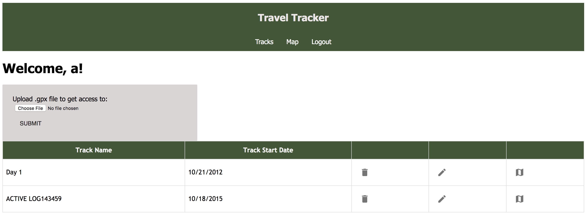
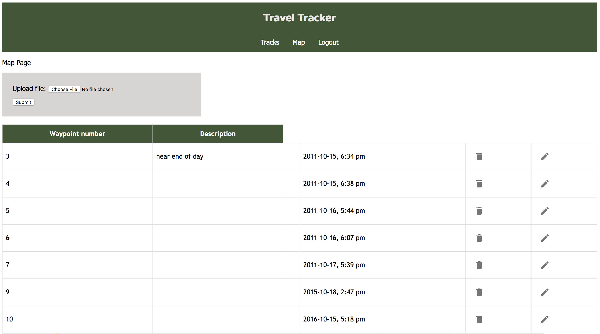
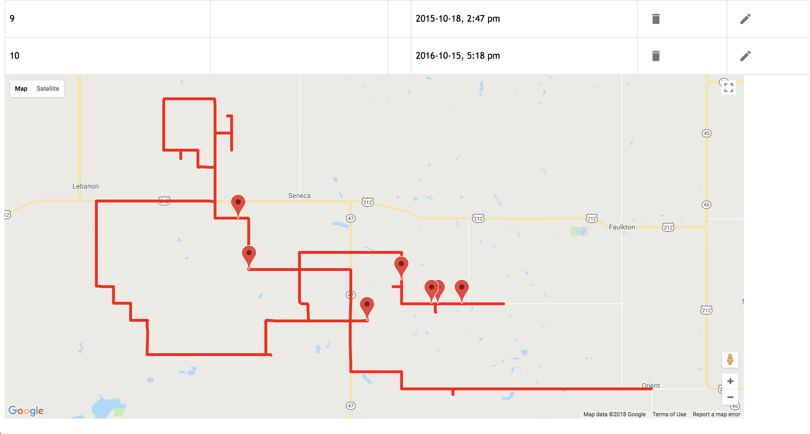

# Travel Tracker

This app allows the user to upload a .GPX file taken from their own personal GPS device and visualize the paths that they have taken on a map. They will also be able to upload a .GPX file containing Waypoints or Points of Interest and those will also have a visual representation on the same map.

https://infinite-chamber-98001.herokuapp.com/

## Built With

* Node
* Express
* React
* Postgresql
* Heroku
* Google-Maps-React
* Google Cloud API


## Getting Started

These instructions will get you a copy of the project up and running on your local machine for development and testing purposes. See deployment for notes on how to deploy the project on a live system.

### Prerequisites

Link to software that is required to install the app (e.g. node).

- [Node.js](https://nodejs.org/en/)
- [postgresql](https://www.postgresql.org/download/)


### Installing

Steps to get the development environment running.

```sql
CREATE TABLE "person"
(
   "id" serial PRIMARY KEY,
   "username" varchar(80) NOT NULL UNIQUE,
   "password" varchar(1000) NOT NULL
);

CREATE TABLE "track"
(
   "id" serial NOT NULL PRIMARY KEY,
   "person_id" INT REFERENCES "person" ON DELETE CASCADE,
   "name" varchar(200),
   "date" VARCHAR(200)
);

CREATE TABLE "waypoint"
(
   "id" serial NOT NULL PRIMARY KEY,
   "latitude" DECIMAL NOT NULL,
   "longitude" DECIMAL NOT NULL,
   "description" varchar(1000),
   "img_url" varchar(1000),
   "elevation" DECIMAL,
   "is_expanded" BOOLEAN DEFAULT 'false',
   "time" VARCHAR(200),
   "track_id" INT REFERENCES "track" ON DELETE CASCADE
);

CREATE TABLE "trackpoint"
(
   "id" serial NOT NULL PRIMARY KEY,
   "latitude" DECIMAL NOT NULL,
   "longitude" DECIMAL NOT NULL,
   "elevation" DECIMAL,
   "time" VARCHAR(200) NOT NULL,
   "track_id" INT REFERENCES "track" ON DELETE CASCADE
);

```

## Screen Shot





## Documentation

- [Scope Document](https://docs.google.com/document/d/1aliInvhuFmp6TpqfagXPcCM1GzIhoDsHXye5cA_Jxrs/edit?usp=sharing)
- [Node.js](https://nodejs.org/en/)
- [React.js](https://reactjs.org/)
- [postgresql](https://www.postgresql.org/docs/)
- [material-ui-next](https://material-ui-next.com/)
- [Moment.js](https://momentjs.com/docs/)

### Completed Features

High level list of items completed.

- [x] User able to upload a Track/Waypoint data
- [x] Displaying Track/Waypoint data in table
- [x] Loading Track/Waypoint data to display on map
- [x] Allow user to go back and forth between tracks 
- [x] Allow user to add more information to each waypoint via a description box
- [x] Allow user to upload an image to each waypoint.

### Next Steps

Features that you would like to add at some point in the future.

- [ ] Migrate away from Google-Maps-React and towards React-Google-Maps.
- [ ] give more information to the user based of time of track and location for weather data.

## Authors

* Teagan Nouska

## Acknowledgments

* Thank you to PrimeAcadamy Staff for the base initialization of this project.
